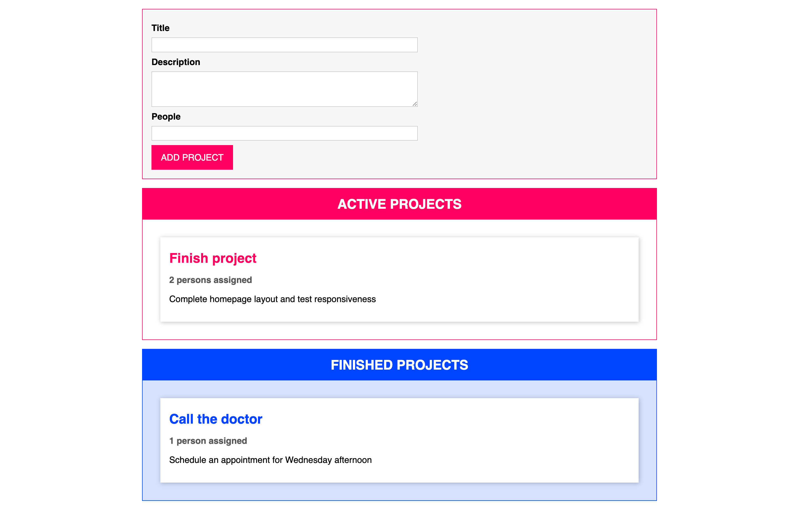

# Drag and Drop Project (with TypeScript)

This is my first project built using **TypeScript**, developed as part of a practical exercise from a Udemy course. It implements a simple drag-and-drop interface using modern web technologies and strong typing with TypeScript.

## Features

- Drag and drop items between lists
- Strong typing with TypeScript
- Lightweight implementation using vanilla JS/TS
- Minimal UI with HTML5 and CSS3

## Technologies Used
- TypeScript
- HTML5
- CSS3

## How to Run

1. Clone the repository
```bash
git clone https://github.com/halynabondar/Drag-and-drop-ts.git
```

2. Run `tsc` to compile the TypeScript code into JavaScript
```bash
tsc
```

3. Run the project
```bash
npm start
```

## What I Learned

- Setting up and compiling TypeScript projects
- Using interfaces, classes, and strong typing
- Implementing drag-and-drop with vanilla TypeScript
- Structuring code for clarity and scalability

## Screenshot

